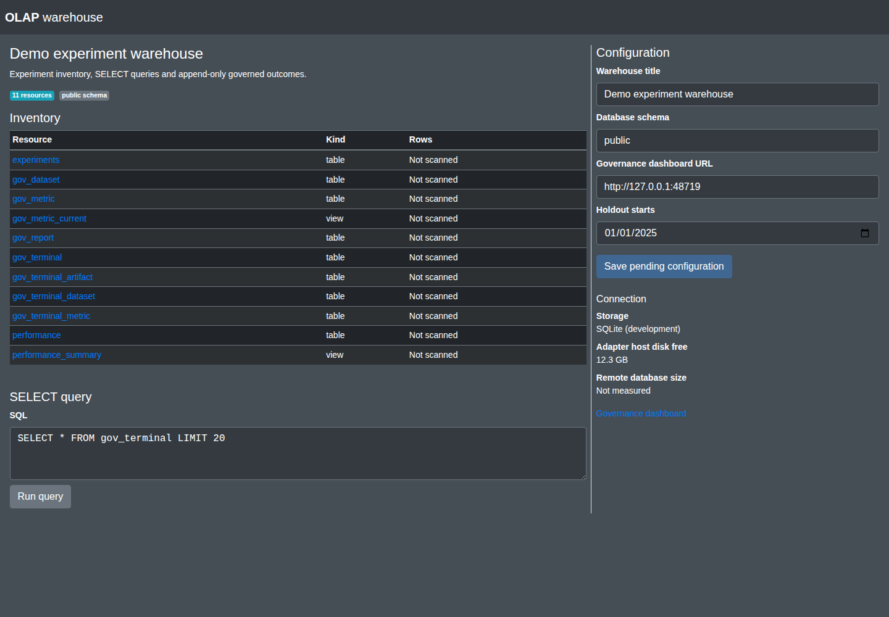

# data-gov

**A shared governance service for experimental data and results.** Register
datasets, apply access policies, deliver identifiable data, and record each
experiment's inputs and outcome in a configured analytical warehouse.

data-gov answers: **who used, what data, for which experiment, when, and
where were the results recorded?** It does not train models, clean signals,
host the source datasets or replace the database that stores experiment results.

## Contents

- [Architecture and repositories](#architecture-and-repositories)
- [Capabilities and boundaries](#capabilities-and-boundaries)
- [Quickstart](#quickstart)
- [Web interfaces](#web-interfaces)
- [Connect a data lake](#connect-a-data-lake)
- [Connect a warehouse](#connect-a-warehouse)
- [Run a governed experiment](#run-a-governed-experiment)
- [Use with a coding agent](#use-with-a-coding-agent)
- [Configuration](#configuration)
- [HTTP API and Python client](#http-api-and-python-client)
- [Testing and verification](#testing-and-verification)
- [Operations and troubleshooting](#operations-and-troubleshooting)
- [Plugins and development](#plugins-and-development)
- [Limitations, licensing and further reading](#limitations-licensing-and-further-reading)

## Architecture and repositories

```text
Experiment / agent
       |
       | campaign, requested inputs, delivery receipts, final outcome
       v
   data-gov -------------------------------------------+
       |                                               |
       | HTTP adapter                                  | HTTP adapter
       v                                               v
data-lake + financial-data-store                 data-warehouse + predictor-olap-store
CSV / Parquet file inventory                     PostgreSQL warehouse
source bytes and materialized cuts               tables, views, gov_* results
```

| Component | Implementation | Default local address |
|---|---|---|
| Governance kernel, catalog, policy and accounting | **This repository** | `http://127.0.0.1:5055` |
| File host and console; external financial provider | [data-lake](https://github.com/harveybc/data-lake) + [financial-data/store](https://github.com/harveybc/financial-data/tree/master/store) | `http://127.0.0.1:5056` |
| Warehouse host and console; external OLAP provider | [data-warehouse](https://github.com/harveybc/data-warehouse) + [predictor/olap/store](https://github.com/harveybc/predictor/tree/master/olap/store) | `http://127.0.0.1:5057` |
| Existing OLAP schema and ETL | [predictor/olap](https://github.com/harveybc/predictor/tree/master/olap) | PostgreSQL connection, not a web service |
| Analytical dashboards | Metabase, configured separately against PostgreSQL | Deployment-specific |

**The reusable warehouse host is in data-warehouse; its OLAP provider and
historical schema are in predictor.** The reusable file host is in data-lake;
its financial provider is in financial-data. Neither host needs predictor's
training dependencies. The older `financial-data/lake` and `predictor/olap/lake`
adapters remain as migration references, not the current deployment entry points.

The new hosts were deployed on 2026-09-14. A production micro-run using a separate
synthetic source verified delivery, metrics, idempotence and reconciliation.
Financial inventory stayed unchanged; financial governing downloads still need
producer-derived resource contracts. See the
[acceptance receipt](https://github.com/harveybc/predictor/blob/master/docs/handoffs/MUSASHI_STORE_HOSTS_PRODUCTION_ACCEPTANCE_2026_09_14.md).

The expanded synthetic catalogue now supports successful bounded production
runs of preprocessor, feature-eng, feature-extractor and predictor through the
new hosts. Twelve outcomes and 119 metrics reconciled in the
[four-consumer check](https://github.com/harveybc/predictor/blob/master/docs/handoffs/MUSASHI_SYNTHETIC_CATALOG_AND_FOUR_CONSUMERS_ACCEPTANCE_2026_09_14.md).
This does not certify fit/transform causality or finish offline DOIN adoption.

A **lake** keeps native files interpreted on read. A **warehouse** exposes
structured tables and views with defined schemas. Both can be local or remote;
neither requires a cloud provider. `kind` describes the store, `engine` its
implementation, and `transport` how the adapter reaches it. They do not grant
permissions or establish dataset quality.

## Capabilities and boundaries

| Implemented | Important boundary |
|---|---|
| One policy and accounting kernel for multiple stores | No per-download human approval and no second policy engine per store kind |
| File inventory, temporal cuts, downloads and delivered-byte hashes | Inventory metadata is not a content hash; availability must be declared from producer evidence |
| Campaign registration and verified delivery receipts | A permitted transfer is not a verified receipt until the client confirms it |
| Outcome reporting and reconciliation | Completed, failed, inconclusive, refused and quarantined outcomes are retained |
| Durable client outbox and idempotent reporting | Permanent errors remain visible; retries do not silently turn them into successes |
| AdminLTE catalog and operator configuration | Configuration edits are staged, not hot-applied to running campaigns |
| Warehouse SELECT queries and structured reporting | Not an arbitrary SQL-write endpoint or a database-credential broker |
| Event-driven role hooks | Hooks are not an autonomous data-quality team or proof of scientific validity |

The current implementation **streams data through data-gov**; it does not
hand out one-use signed download URLs. Clients write metrics through the
reporting API; they do not receive a database connection for direct INSERTs.

## Quickstart

Use **isolated service environments**. Legacy adapters share names such
as `app` and `web_plugins`; co-installing those can resolve the wrong modules.
The new hosts and providers use distinct package namespaces and were also tested
together in a clean, dedicated store environment.
Python 3.12 is the tested version for this guide. The package does not declare
an enforced minimum Python version. No GPU is needed.

```bash
git clone https://github.com/harveybc/data-gov.git
cd data-gov
python3 -m venv .venv
source .venv/bin/activate
pip install -r requirements.txt
pip install -e .
python scripts/issue_credentials.py
python -m app.main --help
python -m pytest tests -q
```

The bootstrap creates local `var/credentials.json`, `var/lake_token`,
`var/flask_secret`, and **`var/config.json` with matching principal hashes**.
Existing files are preserved. Read your generated credentials locally; they
are neither web URLs nor files to commit. The template in
[`examples/config/default.json`](examples/config/default.json) is not a live
account directory.

Start the configured stores using the examples below, then:

```bash
sh scripts/serve.sh
curl --fail http://127.0.0.1:5055/healthz
```

Open `http://127.0.0.1:5055/login`. The generated human account names are
`harvey` and `musashi`; their passwords are generated, not documented defaults.
Store credentials and policy must match before data can be delivered.

For a standalone check with no real datasets or warehouse, run the
[disposable three-service test](#testing-and-verification) instead. A healthy
`/healthz` response alone does not demonstrate working integrations.

## Web interfaces



The screenshot uses a disposable fixture, not production experiment results.
The [configuration and mobile captures](docs/operator-console/VERIFICATION.md)
show the other operator views.

| Console | What an operator can do | Where configuration belongs |
|---|---|---|
| **data-gov** | Browse stores and usage; inspect kinds, resources, principals and policies; validate and save a pending configuration at `/settings` | Registered stores, policies, governance host/port and download concurrency |
| **Financial lake** | Browse file inventory and disk usage; adjust include patterns and holdout; request a coverage probe | Source root, include patterns, per-resource temporal contracts and lake service settings |
| **OLAP warehouse** | Browse tables and views; inspect columns, types, nullability, keys and indexes; view bounded SELECT results; stage settings | Database schema, warehouse title, holdout and governance dashboard link; database credentials stay in `PG*` environment variables |

AdminLTE CSS is bundled locally. Warehouse metadata discovery does not scan
every table to count its rows: **Not scanned** means unknown, not zero. The
adapter's host disk statistics do not measure a remote PostgreSQL server.

The data-gov settings editor preserves credentials server-side. Saving creates
`var/operator_config.json`; it does **not** switch the running service. To
activate it during a controlled restart:

```bash
sh scripts/serve.sh --load_config var/operator_config.json
```

For either reusable host, validate the pending configuration and select it as the
next active configuration during a controlled service restart. Keep the active
and pending paths distinct. Saving in the new host consoles does not change the
live inventory. A dashboard link is **not automatic registration**: register the
host API URL in data-gov as shown below. These are local operator consoles, not
hosted multi-tenant database-administration products.

## Connect a data lake

Install [data-lake](https://github.com/harveybc/data-lake) and the separately
packaged [financial provider](https://github.com/harveybc/financial-data/tree/master/store).
The provider reads the configured data directory; installation does not download
financial datasets. Pin reviewed commits in reproducible deployments.

```bash
python3 -m venv .venv
source .venv/bin/activate
pip install "git+https://github.com/harveybc/data-lake.git"
pip install "git+https://github.com/harveybc/financial-data.git#subdirectory=store"
export DATA_GOV_LAKE_TOKEN_FILE=/absolute/path/to/data-gov/var/lake_token
python -m data_lake_service.main --load_config /absolute/path/to/financial-host.json
```

The adapter config, not the governance config, owns the physical files:

```json
{
  "store_id": "financial_files",
  "web_host": "127.0.0.1",
  "web_port": 5056,
  "backend": {
    "entry_point": "financial_files",
    "distribution": "financial-data-store",
    "settings": {
      "root_path": "/absolute/path/to/financial-data",
      "include_globs": ["market_data/**/*.parquet", "market_data/**/*.csv"],
      "holdout_start": "2025-01-01",
      "resource_contracts": {}
    }
  }
}
```

An empty `resource_contracts` supports inventory, **not governing downloads**.
Add contracts for the specific resources being used; the
[integration guide](docs/INTEGRATION_EXAMPLES.md#temporal-resource-contract)
shows a known-time fixture and explains why it is not a template for guessing
financial availability.

Add this entry to data-gov's `lakes` list:

```json
{
  "plugin": "http_lake",
  "lake_id": "financial_files",
  "title": "Financial data",
  "kind": "lake",
  "engine": "files_inventory",
  "base_url": "http://127.0.0.1:5056",
  "holdout_start": "2025-01-01"
}
```

Add the matching policy to `policies`:

```json
{
  "principal": "predictor",
  "lake": "financial_files",
  "verbs": ["discover", "coverage", "read", "download"],
  "deny_from": "2025-01-01"
}
```

These are entries to merge into the existing lists, not standalone complete
governance configurations. `deny_from` is an example project boundary, not a
universal cutoff for every dataset.

## Connect a warehouse

Install [data-warehouse](https://github.com/harveybc/data-warehouse) and
[predictor-olap-store](https://github.com/harveybc/predictor/tree/master/olap/store)
in a dedicated environment. PostgreSQL may be local or remote.

```bash
pip install "git+https://github.com/harveybc/data-warehouse.git"
pip install "git+https://github.com/harveybc/predictor.git#subdirectory=olap/store"
export PGHOST=127.0.0.1
export PGPORT=5432
export PGDATABASE=predictor_olap
export PGUSER=your_database_user
# Set PGPASSWORD in the service environment, not in a committed script.
export DATA_GOV_LAKE_TOKEN_FILE=/absolute/path/to/data-gov/var/lake_token
python -m data_warehouse_service.main --load_config /absolute/path/to/warehouse-host.json
```

`warehouse-host.json` selects the installed provider, not a repository import:

```json
{
  "store_id": "olap_cube",
  "web_host": "127.0.0.1",
  "web_port": 5057,
  "backend": {
    "entry_point": "predictor_olap",
    "distribution": "predictor-olap-store",
    "settings": {"schema": "public"}
  }
}
```

The adapter needs an existing PostgreSQL database. It creates its additive
`gov_*` reporting tables; it does not create all historical predictor fact and
dimension tables. SQLite is supported for isolated development and tests.

Register the adapter and its policy in data-gov:

```json
{
  "plugin": "http_lake",
  "lake_id": "olap_cube",
  "title": "Experiment warehouse",
  "kind": "warehouse",
  "engine": "sql_olap",
  "base_url": "http://127.0.0.1:5057"
}
```

```json
{
  "principal": "predictor",
  "lake": "olap_cube",
  "verbs": ["discover", "query", "write_metrics", "write_terminal"],
  "require_lineage": true
}
```

A remote warehouse uses the same contract: put its reachable adapter address
in `base_url`; configure PostgreSQL on that adapter host. The experiment never
needs to know the database password. This config does not rewrite an existing
DOIN ETL automatically; that consumer still needs an explicit integration.

## Run a governed experiment

The current **Flow v3** workflow uses the `/api/v2/*` routes. The flow version
and HTTP route version are different identifiers.

1. Register the campaign before consuming inputs: units, code/config identity,
   requested resources and result destination.
2. Download each declared input. Verify the delivered hash and confirm receipt.
   Reused cache bytes are rehashed and recorded as cache use.
3. Run locally on those bytes. No governance calls belong inside training
   batches, `fit`, `transform` or environment steps.
4. Persist an outcome locally, including failures and inconclusive results,
   before attempting to send it. Include metrics, artifact hashes and costs.
5. Report to the configured warehouse and reconcile its terminal identities
   with accounting. Keep unresolved outbox entries visible.

Use [`tools/governed_exec.py`](tools/governed_exec.py) for a command-based
consumer or the [predictor integration guide](https://github.com/harveybc/predictor/blob/182bf89fa0754e3b7b2cea208621531331af931e/docs/GOVERNED_RUN.md)
for that separately versioned training integration. The
[generic example](docs/INTEGRATION_EXAMPLES.md#command-based-consumer) shows
the actual spec format. A plugin profile test is not proof that its full
training pipeline has adopted governance.

Synthetic inputs need retained generator configuration, seed/code identity and
data/artifact hashes too. Mechanics-only probes may be `NON_GOVERNING`; they
must not be presented as scientific evidence. The current generic CLI requires
at least one declared dataset for `GOVERNING` runs, so publish synthetic inputs
through a configured store when using that path.

## Use with a coding agent

Give the agent repository access and this task:

> Read AGENTS.md, README.md and docs/06_FLOW_V3_FAILSAFE.md. Inspect the actual
> configuration and plugin entry points. Use isolated environments and a
> disposable lake and warehouse. Run the relevant tests and the three-service
> integration check. Show me the input receipt hashes, terminal status,
> reconciliation and exact artifact paths. Do not start scientific training,
> overwrite existing outputs, restart deployed services or write to the real
> cube as part of a smoke test. Distinguish tested code from deployed code.

For a new adapter, also read [the store contract](docs/03_LAKE_ADAPTER.md) and
[test-led console design](docs/operator-console/DESIGN_AND_TESTS.md). Begin with
interface and behavioral tests; preserve the pending/active distinction and
document unsupported operations. For a web-only agent, provide GitHub links
and exact commits instead of local machine paths.

## Configuration

| Setting | Purpose |
|---|---|
| `lakes[]` | Store ID, adapter, kind, endpoint or local data location |
| `policies[]` | Principal, store, permitted verbs and applicable temporal/lineage rules |
| `principals` | Person/service identity records; bootstrap values are local |
| `web_host`, `web_port` | Governance listener, default loopback / 5055 |
| `accounting_db` | SQLite accounting database; distinct from the warehouse |
| `cuts_dir`, `spool_dir` | Materialized cuts and temporary transfer files |
| `max_downloads` | Concurrent download slots, not training parallelism |
| `operator_config_path` | Optional path for the pending operator configuration |

Merge precedence is plugin defaults, application defaults, JSON, then
**long-form CLI flags**. Run `python -m app.main --help` for supported flags.
Relative storage paths are resolved by the application's entry point; prefer
explicit absolute paths in deployed configs. Preserve existing IDs when
moving a service to another host.

Compatibility names `datagov.lake`, `lakes[]`, `lake_id` and `?lake=` refer to
both store kinds. There is no required cloud stack, external identity platform
or separate `lakehouse` product.

## HTTP API and Python client

Service calls use `Authorization: Bearer ...`. Legacy experiment operations
also require `X-Experiment-Key`. Flow v3 deliveries bind
`X-Campaign-SHA256` and `X-Unit-ID`.

| Route | Purpose |
|---|---|
| `GET /healthz` | Process health |
| `GET /api/v1/lakes` | Governed store catalog |
| `GET /api/v1/resources?lake=...` | Resource inventory |
| `GET /api/v1/coverage?lake=...&resource=...` | File coverage probe |
| `GET /api/v1/query?lake=...&sql=...` | Bounded warehouse SELECT, with usage accounting |
| `POST /api/v2/campaigns` | Register campaign |
| `GET /api/v2/download` | Download declared data |
| `POST /api/v2/deliveries/<id>/confirm` | Confirm local receipt |
| `POST /api/v2/campaigns/<sha>/units/<unit>/terminal` | Report an outcome |
| `GET /api/v2/campaigns/<sha>/reconcile` | Find missing or unmatched outcomes |
| `GET /api/v1/experiments/<key>/usage` | Experiment usage history |
| `GET /api/v1/datasets/<sha>/usage` | Delivered-dataset usage history |

[`app.client.DataGovClient`](app/client.py) provides `lakes`, `resources`,
`coverage`, `query`, `submit_campaign`, `governed_download`, `report_terminal`
and `reconcile_campaign`. Methods return an HTTP status and payload; callers
must handle non-success statuses. Exact bodies are defined in
[`app/governance.py`](app/governance.py) and [Flow v3](docs/06_FLOW_V3_FAILSAFE.md).

## Testing and verification

```bash
python -m pytest tests -q
PYTHONPATH=. python tools/verify_flow_v3_e2e.py \
  --financial-lake-checkout ../financial-data/lake \
  --olap-lake-checkout ../predictor/olap/lake
```

The E2E tool starts its own three processes on temporary ports, generates a
tiny known-time CSV and a disposable SQLite warehouse, then stops its services.
It needs the lake/warehouse dependencies available to its test interpreter.
It checks registration, delivery, confirmation, terminal storage and exact
reconciliation. It is not a PostgreSQL deployment test or a model-quality test.

See [verification evidence](docs/operator-console/VERIFICATION.md) for the
tested snapshot, test counts and browser checks. Optional external PostgreSQL
tests require a **disposable** database, never the production cube.

## Operations and troubleshooting

| Symptom | Check |
|---|---|
| Service healthy, integrations unavailable | Store process, endpoint and shared service token; health alone checks no delivery |
| Fresh login fails | Use generated credentials and `var/config.json`, not unrelated hashes from the template |
| No resources | Root directory, include patterns, schema and database reachability |
| Governing download refused | Exact resource contract, campaign role/range, receipt and temporal availability |
| Pending settings appear unchanged | Saved settings require an explicit restart with that file; no hot reload is claimed |
| Outcome pending | `governed_exec.py --status`; fix the recorded cause before `--flush` |
| Permanent reporting rejection | Inspect the reason; documented `--dispose`/`--supersede` preserve the history |
| Hash matches but experiments differ | Compare partitions, preprocessing state, code, dependencies, seeds and hardware as well |

Back up accounting, local configuration, pending outboxes and the warehouse
before an upgrade. Keep source/cut artifacts or enough recorded information to
recreate them. Do not run `predictor/olap/reset_olap.py` against real results.
Do not silently delete failed runs or pending outcomes to clear a dashboard.

## Plugins and development

| Entry-point group | Responsibility |
|---|---|
| `datagov.pipeline` | Application orchestration |
| `datagov.web` | UI and HTTP service |
| `datagov.access` | Principals and policies |
| `datagov.accounting` | Usage and campaign records |
| `datagov.lake` | Store adapters: `files_lake`, `sql_lake`, `http_lake` |
| `datagov.role` | Event-driven role hooks |

Register plugins with setuptools entry points and install their distributions
in the service environment. The JSON selects an installed entry-point name;
a GitHub URL in JSON does not install a package. Use a unique Python package
namespace for external plugins. Do not reuse `app` in new packages.

The [package-separation design](docs/STORE_PACKAGES_DESIGN.md) describes proposed
`data-lake` and `data-warehouse` hosts with external providers. Those are a
migration plan, **not existing repositories or an already-deployed interface**.
The current implementations linked above remain the supported starting point.

## Limitations, licensing and further reading

Hashes and accounting establish traceability, not legal rights, causal
validity, noise-free data, predictive value or trading profitability. A SQL
result hash identifies the returned serialization, not an immutable database
snapshot. The SELECT interface is for analytics, not a replacement for governed
temporal input delivery.

Some consumers have profile wrappers but no demonstrated full-pipeline
integration. The implementation contains compatibility paths; new experiments
should use Flow v3. No universal end-to-end adoption or external beta is claimed.

No repository-wide `LICENSE` file is currently included. Public visibility is
not a license grant. Bundled third-party assets retain their own notices,
including AdminLTE and Bootstrap; dataset rights are separate again.

- [Product contract](docs/00_CONTRATO.md)
- [Integration examples](docs/INTEGRATION_EXAMPLES.md)
- [Store adapter contract](docs/03_LAKE_ADAPTER.md)
- [Flow v3](docs/06_FLOW_V3_FAILSAFE.md) and [legacy Flow v2](docs/04_FLOW_V2.md)
- [Research repository map](https://github.com/harveybc/predictor/blob/master/docs/RESEARCH_STACK.md)
- [README quality standard](https://github.com/harveybc/predictor/blob/master/docs/README_STANDARD.md)

For an issue or contribution, report the exact commit, sanitized configuration,
small reproducer, expected result and actual result. Include structural and
behavioral tests for changed contracts. Do not attach private datasets or keys.
